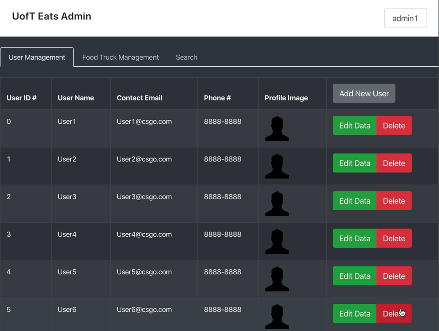
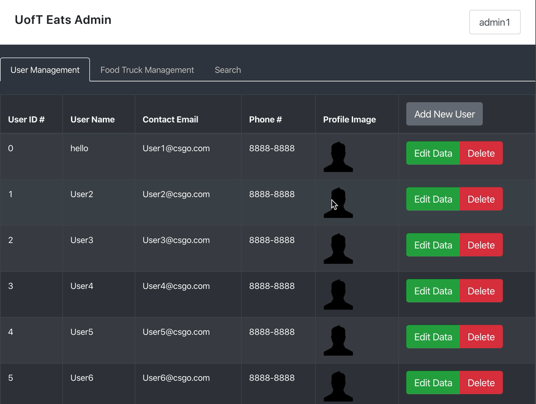

# team49

## Project Overview

UofTEats is a website for university students to order their food served by food trucks online. Similar to the interface of UberEats, each food truck has its own spot on UofTEats where students can get an intuitive view to all available food trucks. By clicking each truck’s view, students can order any food they want from the menu of the specific food truck and set a time to take the order from the truck.

This website is intended not only to solve the issue that students have to suffer from the extremely hot/cold weather while waiting for the order to be ready, but also save their time by ordering their lunch/dinner before the lecture is finished.

## User Side

#### Search for food truck

User can search food truck by name on the main page of user side. After clicking the search icon, only trucks that match up the search key will be filtered out.

#### Add food into cart

User can add food items into cart by clicking "Add to Cart" button, and increase or decrease number of items to order. 

#### Schedule pick-up

After finishing adding food into cart, user can choose a pick-up time by selecting date and time. Also, user can leave a note to the food truck by entering into an input box.

## Admin Side

#### Basic utilities

After login to the admin dashboard, the admin will have the access to the information of all users and food trucks by switching between "User Management" and "Food Truck Management" tabs.

For each entry listed blow, the admin can either edit the info or delete a user/food truck. The admin can create new user or food truck as well.

#### Search

When entering the Search tab, the admin can search for a paticular user or food truck by providing its Id number. On the display card of the particular user, the admin will have the ability to edit or delete.
